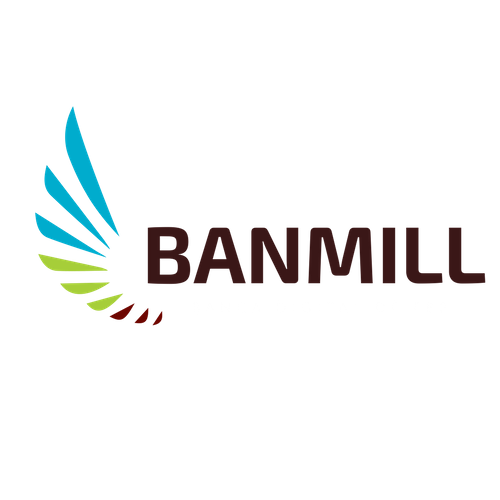
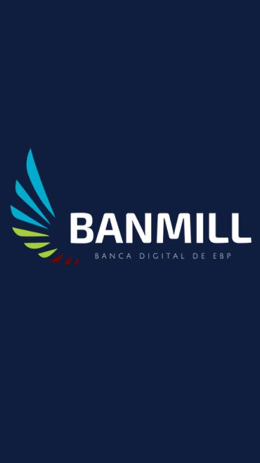
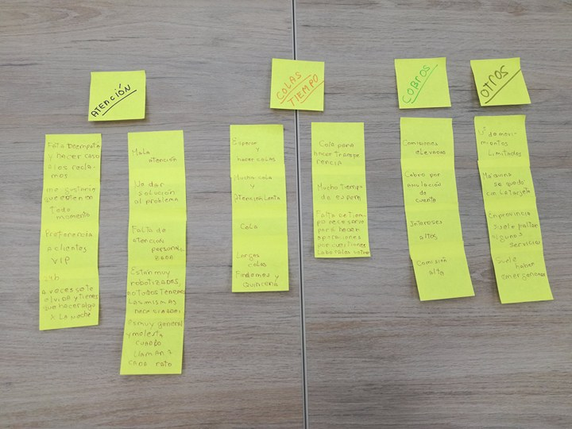

# Banmill

Banmill es una propuesta de un banco 100% digital, permitiendo al usuario realizar las mismas operaciones que realiza en un banco presencial, pero menos complicado y más sencillo.

# Desarrollado para:

[Laboratoria](http://www.laboratoria.la/)

# Detalles del Proyecto:

* **TRACK:** *ESPECIALIZACIÓN UX-DESIGNER*
* **CURSO:** *CONOCIENDO LOS NEGOCIOS*
* **UNIDAD 1:** *LECCIONES BÁSICAS DE NEGOCIOS*

# Equipo de trabajo:

* Maria Teresa Ruíz Quispe.
* Darcy Isabel Cervera Huamaní.

# Descripción del reto:

El Banco del País es uno de los bancos más importante de tu país. Es una institución de muchos años y actualmente está pasando por un proceso de transformación digital. Como parte de este proceso, han implementado un área de innovación que quiere llegar de una mejor manera a los usuarios más jóvenes. Por lo que, inspirados en [Nequi](https://www.nequi.com.co/), [Nubank](https://www.nubank.com.br/) y [Simple](https://www.simple.com/) se han propuesto crear un banco 100% digital dirigido para millenials.

# Objetivo:

* Identificar los stakeholders del proyecto
* Planear una reunión kick - off
* Identificar hábitos financieros y preferencias en plataformas digitales de la generación millenial.

# Etapas DCU (Diseño Centrado en el Usuario):

### A. Descubrimiento e Investigación

Actividades:

1. Formulación de las preguntas para la entrevista y encuesta online:

    * Se trabajó de manera individual en el planteamiento de las preguntas, luego se definió y unificó el trabajo para obtener las preguntas que nos permitirán alcanzar el objetivo identificado.

        [Preguntas de la encuesta online](https://darcy43.typeform.com/to/SUCvYy)

2. Entrevista con usuarios:

3. Recolección de datos de la Encuesta a través de Typeform:

### B. Síntesis y Definición

Actividades:

1. Definición del problema: Diagrama de afinidad

El procedimiento que se siguió a través del diagrama de afinidad fué:

* Paso 1: Colocar en post-its los comentarios negativos o problemas que tienen los usuarios al recurrir en un banco.

* Paso 2: Agrupar los post-its por afinidad en temas específicos, los cuales fueron:

    * Atención.
    * Tiempo.
    * Cobros.
    * Otros.

